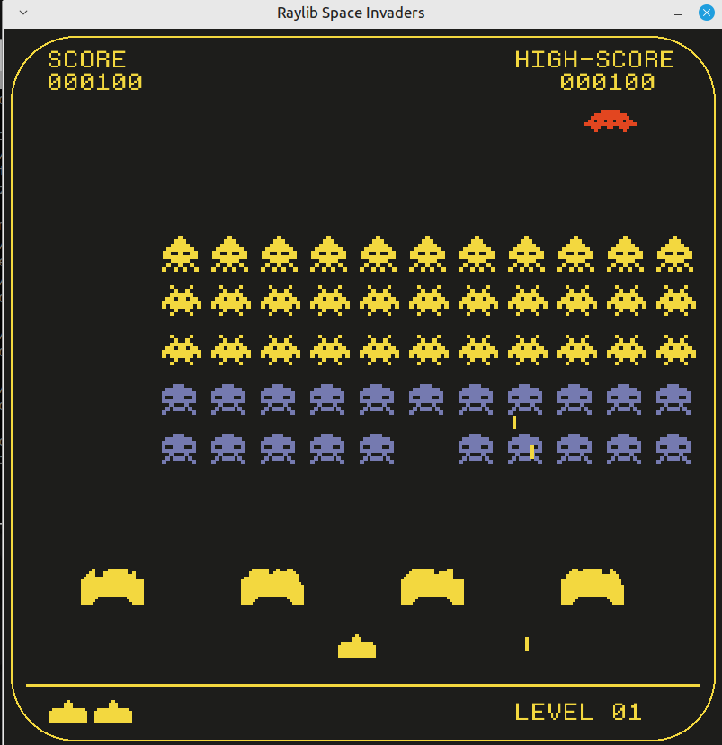

# GAME
Game is made in c++ using Raylib graphics library and CMake which allows cross-platform compatibility.



# How to run

**Required software:**
- cmake ([download cmake](https://cmake.org/download/))
- git ([download git](https://git-scm.com/downloads))

Project can be built inside vscode (cmake tools extension required) or simply from terminal (both methods covered).
***
### GNU Linux
1) first clone the project into desired directory:
```bash
git clone https://github.com/ttcpavle/raylib-game-space-invaders.git
```
2) gcc and make are required:
```bash
sudo apt install build-essential
```
3) install dependencies (Ubuntu):
```bash
sudo apt install libasound2-dev libx11-dev libxrandr-dev libxi-dev libgl1-mesa-dev libglu1-mesa-dev libxcursor-dev libxinerama-dev libwayland-dev libxkbcommon-dev
```
4) create build directory and run cmake: 
```bash
mkdir build && cd build && cmake ..
```
5) if you are using make building tool run the generated `Makefile` with:
```bash
make
```

after that simply run `./SpaceInvaders`
### Windows
1) first clone the project into desired directory:
```bash
git clone https://github.com/ttcpavle/raylib-game-space-invaders.git
```
2) create build directory:
```bash
mkdir build && cd build
```
3) Run `cmake ..`

 If using vcpkg, set CMAKE_TOOLCHAIN_FILE variable(script will still check for VCPKG_ROOT environment variable to set toolchain file)
```bash
cmake .. -DCMAKE_TOOLCHAIN_FILE="<vcpkg-root>/scripts/buildsystems/vcpkg.cmake"
```

4) open visual studio solution (.sln file), right click SpaceInvaders and set as startup project
5) build and run
### visual studio code

Universal vscode approach for building this project:

* open project in vscode `code .`
* type ">" in search bar and select `CMake: Configure` to generate files with cmake (cmake tools extension required)
* type ">" and `Task: Run Task`
* select `Build and Run` (custom task i wrote in tasks.json in .vscode)

Project is based on this tutorial: [youtube tutorial](https://youtu.be/TGo3Oxdpr5o?si=GI0o5ST4p17Mh6z7)

# But what is CMake?

*CMake is a free, cross-platform, software development tool for building applications via compiler-independent instructions. It also can automate testing, packaging and installation. It runs on a variety of platforms and supports many programming languages. As a meta-build tool, CMake configures native build tools which in turn build the codebase. CMake generates configuration files for other build tools based on CMake-specific configuration files...*

So, cmake creates the buildsystem (build automation tools like make, ninja, MSbuild,... ) which can then be used to compile and link the c/c++ project avoiding manual user interaction.

What are automation tools?
*When software projects grow complex, their build steps may involve multiple programming languages or compilation units, making manual build processes increasingly cumbersome. Dependencies between code components necessitate careful ordering and potentially different tools for each piece. Managing these dependencies manually can quickly lead to version conflicts, stale binaries, and difficulty tracking updates, making solutions such as shell scripts too difficult to maintain.*

summarized: cmake ( a configuration file) generates configuration files for other build tools which are then responsible for building.

***